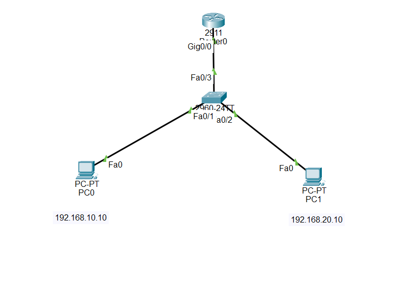

# 🏢 Small Office Network — Cisco Packet Tracer

A small office network designed and implemented in **Cisco Packet Tracer** with VLAN segmentation, router-on-a-stick inter-VLAN routing, DHCP, secure switch management, and Layer 2 security.

This project demonstrates practical networking fundamentals and basic network administration skills relevant to **Network Support, NOC, IT Support, and Junior Network Engineer** roles.

---

## 📌 Project Overview

The objective of this project was to design a small office network that separates users and management traffic into different VLANs while providing:

* VLAN segmentation
* Inter-VLAN routing
* Automatic IP addressing using DHCP
* Secure switch management using SSH
* Port security
* Unused-port shutdown
* Basic switch hardening
* End-to-end connectivity verification

The network uses a **router-on-a-stick** design, where a single router interface provides routing between multiple VLANs through 802.1Q trunking.

---

## 🗺️ Network Topology



### Topology

```text
                    ┌─────────────────────┐
                    │       Router        │
                    │   Router-on-a-Stick │
                    │                     │
                    │ Gi0/0.10 - VLAN 10  │
                    │ Gi0/0.20 - VLAN 20  │
                    └──────────┬──────────┘
                               │
                         802.1Q Trunk
                               │
                         Fa0/3 │
                    ┌──────────┴──────────┐
                    │        SW1         │
                    │    Cisco Switch    │
                    │                    │
                    │ Fa0/1 → VLAN 10    │
                    │ Fa0/2 → VLAN 20    │
                    └───────┬──────┬──────┘
                            │      │
                         PC-1     PC-2
                       VLAN 10   VLAN 20
                        USERS   MANAGEMENT
```

---

## 🧰 Technologies & Concepts

* Cisco Packet Tracer
* Cisco IOS
* VLANs
* 802.1Q Trunking
* Router-on-a-Stick
* Inter-VLAN Routing
* DHCP
* IPv4 Addressing
* SSH
* Port Security
* Switch Management
* Basic Network Hardening
* Network Troubleshooting

---

## 🌐 IP Addressing Plan

| VLAN | Name       | Network         | Gateway      | Example Host  |
| ---- | ---------- | --------------- | ------------ | ------------- |
| 10   | USERS      | 192.168.10.0/24 | 192.168.10.1 | 192.168.10.10 |
| 20   | MANAGEMENT | 192.168.20.0/24 | 192.168.20.1 | 192.168.20.10 |

### Switch Management

| Device | Interface       | IP Address      |
| ------ | --------------- | --------------- |
| SW1    | VLAN 20 SVI     | 192.168.20.2/24 |
| SW1    | Default Gateway | 192.168.20.1    |

---

## 🔌 Port & VLAN Configuration

| Interface    | Purpose       | VLAN     |
| ------------ | ------------- | -------- |
| Fa0/1        | Users PC      | VLAN 10  |
| Fa0/2        | Management PC | VLAN 20  |
| Fa0/3        | Router trunk  | 802.1Q   |
| Fa0/4–Fa0/24 | Unused        | Shutdown |
| Gi0/1–Gi0/2  | Unused        | Shutdown |

---

## 🚦 Router-on-a-Stick

The router uses subinterfaces to route traffic between VLANs.

### VLAN 10

```text
Interface: Gi0/0.10
IP Address: 192.168.10.1/24
VLAN: 10
```

### VLAN 20

```text
Interface: Gi0/0.20
IP Address: 192.168.20.1/24
VLAN: 20
```

The switch-to-router link uses an 802.1Q trunk.

---

## 📡 DHCP Configuration

The router provides DHCP services for both VLANs.

### VLAN 10 — USERS

```text
Network: 192.168.10.0/24
Gateway: 192.168.10.1
```

### VLAN 20 — MANAGEMENT

```text
Network: 192.168.20.0/24
Gateway: 192.168.20.1
```

Both PCs successfully received their IP configuration through DHCP.

---

## 🔐 Security Configuration

### SSH Management

SSH version 2 was enabled for secure remote management.

```text
SSH Version: 2
Domain: smalloffice.local
VTY Authentication: Local database
VTY Transport: SSH only
```

### Port Security

Port security was enabled on the active access ports:

```text
Fa0/1 → VLAN 10
Fa0/2 → VLAN 20
```

Configuration:

```text
Maximum secure MAC addresses: 1
Violation action: Shutdown
```

Verification:

```text
Fa0/1 → Current MAC: 1 → Violations: 0
Fa0/2 → Current MAC: 1 → Violations: 0
```

### Additional Hardening

* `enable secret`
* Local user authentication
* Password encryption
* MOTD security banner
* VLAN 1 SVI shutdown
* Unused interfaces administratively shut down

---

## 🧪 Verification & Testing

### Router Routing Table

The router showed both VLAN networks as directly connected:

```text
C 192.168.10.0/24
C 192.168.20.0/24
```

### Router → Switch

```text
ping 192.168.20.2
```

**Result:** Successful ✅

### VLAN 10 → VLAN 20

```text
ping 192.168.20.10
```

**Result:** Successful ✅

### VLAN 20 → VLAN 10

```text
ping 192.168.10.10
```

**Result:** Successful ✅

### VLAN 10 PC → Gateway

```text
ping 192.168.10.1
```

**Result:** Successful ✅

### VLAN 10 PC → VLAN 20 Gateway

```text
ping 192.168.20.1
```

**Result:** Successful ✅

### VLAN 10 PC → Switch Management

```text
ping 192.168.20.2
```

**Result:** Successful ✅

### SSH

```text
SSH Enabled - version 2.0
```

**Result:** Verified ✅

### Port Security

```text
Fa0/1 → 1 secure MAC, 0 violations
Fa0/2 → 1 secure MAC, 0 violations
```

**Result:** Verified ✅

---

## 🛠️ Troubleshooting

During implementation, SSH authentication was investigated separately from network connectivity.

A temporary local account was used to verify:

* Management IP reachability
* SSH version 2
* VTY configuration
* Local authentication
* SSH access

The temporary account was removed after successful verification.

This reinforced an important troubleshooting principle:

> **Separate connectivity problems from authentication and configuration problems.**

---

## 📚 Key Learning Outcomes

Through this project, I practiced:

1. Creating and assigning VLANs
2. Configuring access ports
3. Configuring 802.1Q trunking
4. Implementing router-on-a-stick
5. Implementing inter-VLAN routing
6. Configuring DHCP on a Cisco router
7. Configuring a switch management SVI
8. Configuring SSH version 2
9. Using local authentication
10. Implementing switch port security
11. Shutting down unused interfaces
12. Verifying connectivity with `ping`
13. Reading routing tables
14. Troubleshooting network connectivity
15. Saving Cisco IOS configurations

---

## 💡 Practical Scenario

This project represents a simplified small-office environment where:

* **VLAN 10** is used for normal office users.
* **VLAN 20** is used for management devices.
* The router provides inter-VLAN routing and DHCP.
* SW1 provides Layer 2 connectivity and secure management.
* Port security helps restrict unauthorized devices on access ports.
* Unused interfaces are disabled as a basic security measure.

---

## 📁 Project Structure

```text
small-office-network/
│
├── README.md
│
├── topology/
│   └── topology.png
│
├── configs/
│   ├── SW1-config.txt
│   └── Router-config.txt
│
├── documentation/
│   └── verification.md
│
└── troubleshooting/
    └── troubleshooting.md
```

---

## 🚀 Future Improvements

* Restrict the trunk allowed VLAN list
* Add an additional switch
* Implement STP security features
* Add ACLs
* Add centralized network monitoring
* Expand the network with additional departments

---

## 👨‍💻 Author

**Md. Hridoy Sheikh**

Final-year Computer Science and Engineering Student

Interested in Network Engineering, NOC, Network Support, and IT Infrastructure.

GitHub: [Hridoy-851](https://github.com/Hridoy-851)

LinkedIn: [linkedin.com/in/hridoysheikh00](https://linkedin.com/in/hridoysheikh00)

---

## 📌 Project Status

**Completed ✅**

Built and tested using Cisco Packet Tracer.
